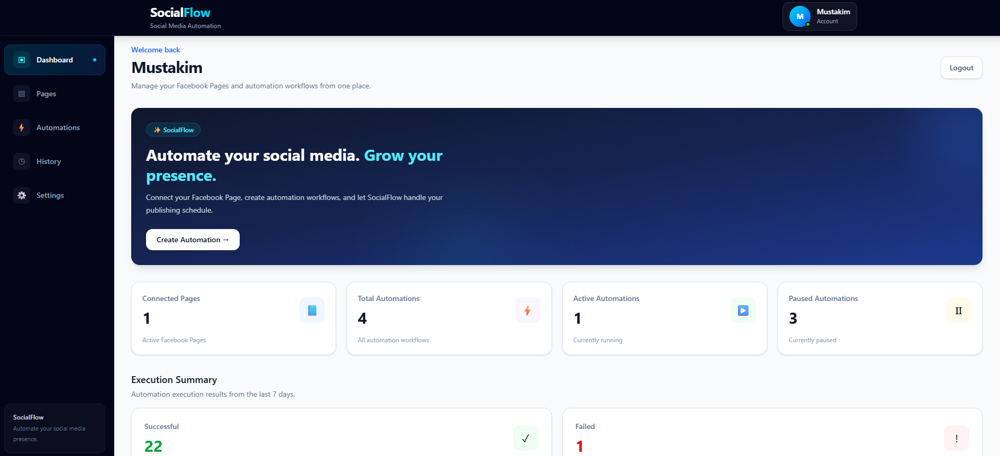

# 🚀 SocialFlow Backend

SocialFlow is an AI-powered social media automation platform that helps users create and publish content to their Facebook Pages automatically at scheduled times.

This repository contains the **backend/API server** of SocialFlow. It manages authentication, Facebook integration, AI-powered content generation, automation scheduling, Facebook publishing, retry handling, and data management.

---

## 🌐 Project Links

### Live Application

**Frontend:**  
https://social-media-automation-frontend-taupe.vercel.app/

### Repositories

**Frontend:**  
https://github.com/mustakim6/social-media-automation-frontend

**Backend:**  
https://github.com/mustakim6/social-media-automation-backend

---

# 📌 Project Overview

Managing social media content consistently can be time-consuming.

SocialFlow is designed to automate this process.

A user can:

1. Create an account and log in.
2. Connect their Facebook account.
3. Select a Facebook Page they have access to.
4. Create an automation by providing a prompt.
5. Select the content type and posting time.
6. Let AI generate the content.
7. Allow SocialFlow to automatically publish the generated content to the selected Facebook Page.

The backend runs the automation independently through a server-side scheduler.

### Basic Workflow

```text
User
 │
 ▼
SocialFlow Frontend
 │
 ▼
Backend API
 │
 ├── Authentication
 │
 ├── Facebook OAuth
 │
 ├── Facebook Page Management
 │
 ├── AI Content Generation
 │
 └── Automation Management
 │
 ▼
Automation Scheduler
 │
 ▼
AI Content Generation
 │
 ▼
Facebook Graph API
 │
 ▼
Facebook Page
```

---

# ✨ Key Features

- 🔐 JWT-based authentication
- 🍪 HTTP-only authentication cookies
- 👤 User account management
- 🔗 Facebook OAuth integration
- 📄 Facebook Page connection
- 🤖 AI-powered content generation
- 🧠 Gemini AI integration
- ⏰ Daily scheduled automation
- 🌍 Timezone-aware scheduling
- 🔄 Automatic retry mechanism
- 📝 Text-only Facebook posts
- 🎨 AI-generated content cards
- 🗑️ Facebook deauthorization/data deletion support
- 🔒 User ownership validation
- 📊 Automation execution tracking
- ⚡ REST API architecture

---

# 🛠️ Tech Stack

## Backend

- **Node.js**
- **Express.js**
- **JavaScript (ES Modules)**

## Database

- **MongoDB**
- **Mongoose**

## Authentication & Security

- **JWT**
- **bcrypt**
- **HTTP-only Cookies**
- **CORS**

## AI

- **Google Gemini**
- **OpenAI SDK** *(available for provider support)*

## Social Media

- **Meta Graph API**
- **Facebook OAuth**

## Automation

- **node-cron**
- **Luxon**

## Image / Content Processing

- **Sharp**

---

# 🏗️ Backend Architecture

SocialFlow follows a modular backend architecture.

```text
Client
  │
  ▼
Routes
  │
  ▼
Middleware
  │
  ▼
Controllers
  │
  ▼
Services
  │
  ├── Database
  ├── AI Provider
  ├── Facebook Graph API
  └── Automation Logic
```

### Responsibilities

**Routes**

Define API endpoints and connect them with controllers.

**Middleware**

Handles authentication and request-level protection.

**Controllers**

Handle HTTP requests and responses.

**Services**

Contain business logic such as Facebook API communication, AI content generation, and automation execution.

**Models**

Define MongoDB data structures using Mongoose.

---

# 📁 Project Structure

The backend follows a modular structure similar to:

```text
backend/
│
├── src/
│   │
│   ├── config/
│   │   └── database configuration
│   │
│   ├── controllers/
│   │   ├── authController.js
│   │   ├── facebookController.js
│   │   ├── automationController.js
│   │   └── facebookWebhookController.js
│   │
│   ├── middleware/
│   │   └── authMiddleware.js
│   │
│   ├── models/
│   │   ├── User.js
│   │   ├── FacebookPage.js
│   │   ├── FacebookOAuthSession.js
│   │   ├── Automation.js
│   │   └── ...
│   │
│   ├── routes/
│   │   ├── authRoutes.js
│   │   ├── facebookRoutes.js
│   │   ├── automationRoutes.js
│   │   └── facebookWebhookRoutes.js
│   │
│   ├── services/
│   │   ├── facebookService.js
│   │   ├── automationService.js
│   │   ├── automationExecutionService.js
│   │   ├── facebookDataService.js
│   │   └── ...
│   │
│   ├── scheduler/
│   │   └── automationScheduler.js
│   │
│   ├── app.js
│   └── server.js
│
├── package.json
└── README.md
```

> The exact structure may evolve as the project grows.

---

# 🔐 Authentication

SocialFlow uses **JWT-based authentication** with an HTTP-only cookie.

## Authentication Flow

```text
Register
   │
   ▼
Password hashed with bcrypt
   │
   ▼
User stored in MongoDB
```

For login:

```text
Login Request
     │
     ▼
Find User
     │
     ▼
Compare Password
     │
     ▼
Generate JWT
     │
     ▼
Store JWT in HTTP-only Cookie
```

The authentication cookie is not directly accessible through client-side JavaScript.

This helps reduce the risk of exposing the authentication token through normal client-side access.

---

# 🛡️ Protected Routes

Protected API endpoints use authentication middleware.

The middleware:

1. Reads the authentication cookie.
2. Verifies the JWT.
3. Extracts the authenticated user's ID.
4. Adds the user ID to the request.
5. Allows the request to continue.

Conceptually:

```text
Request
  │
  ▼
Read Cookie
  │
  ▼
Verify JWT
  │
  ├── Invalid → 401 Unauthorized
  │
  └── Valid
        │
        ▼
     req.userId
        │
        ▼
    Controller
```

---

# 📘 Facebook Integration

SocialFlow integrates with Facebook through the **Meta Graph API**.

The purpose of the integration is to allow users to connect Facebook Pages that they have access to and publish automated content to those Pages.

---

# 🔗 Facebook OAuth Flow

The connection process follows an OAuth-based flow.

```text
User
 │
 ▼
SocialFlow
 │
 ▼
Facebook OAuth
 │
 ▼
Facebook Login
 │
 ▼
Authorization
 │
 ▼
Facebook Callback
 │
 ▼
Exchange Authorization Code
 │
 ▼
User Access Token
 │
 ▼
Fetch Available Pages
 │
 ▼
User Selects Page
 │
 ▼
Save Page Information
 │
 ▼
Connected Facebook Page
```

The OAuth state contains information that helps associate the Facebook authorization process with the authenticated SocialFlow user.

The temporary OAuth session is also used while the user selects a Facebook Page.

---

# 📄 Facebook Page Management

After Facebook authorization, SocialFlow retrieves the Pages available to the user.

The user can then select a Page to connect with SocialFlow.

The backend stores the connected Page information and associates it with the SocialFlow user.

This ownership relationship is important because users should only be able to manage their own connected Pages.

---

# 📤 Facebook Publishing

SocialFlow uses the Meta Graph API to publish content.

For text posts, the backend sends the generated message to the Facebook Page's feed endpoint.

For card-style posts, the backend can generate an image and publish it as a Facebook photo with a caption.

Conceptually:

```text
Automation
    │
    ▼
Generate Content
    │
    ▼
Find Connected Facebook Page
    │
    ▼
Get Page Access Token
    │
    ▼
Meta Graph API
    │
    ▼
Facebook Page
```

---

# 🤖 AI Content Generation

SocialFlow uses AI to generate social media content based on the user's prompt.

The automation stores information such as:

- Prompt
- Content type
- AI provider
- Optional image prompt
- Posting time
- Timezone

The AI generation layer is designed around a provider-based approach.

Currently, **Google Gemini** is the primary provider used by the project.

OpenAI support is also prepared in the backend architecture.

---

# 🧠 Content Generation Flow

```text
User Prompt
    │
    ▼
Automation
    │
    ▼
AI Provider
    │
    ▼
Generate Content
    │
    ▼
Validate Generated Content
    │
    ▼
Facebook Publishing
```

This separation allows AI generation logic to remain independent from Facebook publishing logic.

---

# 📝 Supported Content Types

SocialFlow currently supports different content-generation modes.

## 1. Text Only

Generates a text-based post and publishes it to the Facebook Page.

```text
Prompt
  ↓
AI
  ↓
Text Content
  ↓
Facebook Feed Post
```

---

## 2. Card

Generates content and renders it into a visual card.

The card can use predefined visual themes such as:

- Midnight
- Ocean
- Forest
- Berry
- Sunset
- Royal
- Teal

The generated card is then published as a Facebook photo with a caption.

---

## 3. Text + Image

The project architecture includes support for a text + image content type.

However, full AI image storage and Facebook photo publishing for AI-generated images are currently not completed.

See the **Known Limitations** section below.

---

# ⏰ Automation Scheduler

One of the core parts of SocialFlow is the server-side automation scheduler.

The scheduler runs on the backend using `node-cron`.

It checks for due automations every minute.

Conceptually:

```text
Every Minute
     │
     ▼
Check MongoDB
     │
     ▼
Find Active + Due Automations
     │
     ▼
Claim Automation
     │
     ▼
Execute Automation
     │
     ▼
Generate AI Content
     │
     ▼
Publish to Facebook
     │
     ▼
Calculate Next Run
```

The scheduler does not depend on the user's browser tab being open.

The automation logic runs on the backend server.

---

# 🕐 Scheduling Logic

Each automation contains scheduling information such as:

```text
postingTime
timezone
nextRunAt
lastRunAt
isActive
isRunning
```

The backend calculates the next execution time based on the configured posting time and timezone.

For example:

```text
Posting Time: 08:00 PM
Timezone: Asia/Dhaka

        ↓

nextRunAt
        ↓

Scheduler detects when it becomes due
```

---

# 🔒 Preventing Duplicate Execution

The scheduler uses an `isRunning` flag to help prevent the same automation from being executed multiple times simultaneously.

Before execution:

```text
isRunning = false
```

The scheduler claims the automation:

```text
isRunning = true
```

After execution:

```text
isRunning = false
```

The database update is performed conditionally so that multiple scheduler checks do not easily claim the same automation simultaneously.

---

# 🔄 Retry Mechanism

SocialFlow includes automatic retry handling for failed automation executions.

If an automation fails, the backend records information such as:

- `retryCount`
- `retryAt`
- `lastError`
- `lastFailedAt`

The system can retry failed executions after a delay.

The current implementation uses multiple retry attempts with increasing delays.

Conceptually:

```text
Automation Fails
      │
      ▼
Retry #1
      │
      ├── Success → Done
      │
      └── Failure
             │
             ▼
          Retry #2
             │
             ├── Success → Done
             │
             └── Failure
                    │
                    ▼
                 Retry #3
                    │
                    ├── Success → Done
                    │
                    └── Failure → Mark Failed
```

This helps the system recover from temporary API or network failures.

---

# 📊 Automation Execution State

Automations maintain execution-related information such as:

```text
isActive
isRunning
lastRunAt
nextRunAt
retryCount
retryAt
lastError
lastFailedAt
```

These fields help the backend determine:

- Whether an automation is active
- Whether it is currently running
- When it last executed
- When it should execute next
- Whether it needs a retry
- What caused the previous failure

---

# 🗃️ Database

SocialFlow uses **MongoDB** as its primary database with **Mongoose** for schema modeling.

The backend stores information related to:

- Users
- Facebook Pages
- Facebook OAuth sessions
- Automations
- Automation execution state/history

---

# 👤 User Model

The user system stores account-related information.

Passwords are not stored directly.

Instead:

```text
Plain Password
      │
      ▼
bcrypt
      │
      ▼
Password Hash
      │
      ▼
MongoDB
```

This prevents the database from storing users' original passwords.

---

# 📄 Facebook Page Model

Connected Facebook Pages are associated with their SocialFlow user.

Conceptually:

```text
User
 │
 ├── Facebook Page A
 ├── Facebook Page B
 └── Facebook Page C
```

This ownership relationship is used by protected API operations.

---

# ⚙️ Automation Model

An automation stores configuration required to generate and publish scheduled content.

Important fields include:

```text
userId
facebookPageId
prompt
contentType
imagePrompt
llmProvider
frequency
postingTime
timezone
isActive
isRunning
retryCount
retryAt
lastError
lastFailedAt
lastRunAt
nextRunAt
```

This allows the backend to maintain the complete lifecycle of an automation.

---

# 🗑️ Facebook Deauthorization & Data Deletion

SocialFlow also implements Facebook deauthorization/data deletion handling.

The purpose is to respond when a user removes the application's Facebook permissions or requests Facebook-related data removal.

The backend provides a public webhook endpoint for Facebook's data deletion/deauthorization flow.

The system can deactivate associated Facebook Pages and remove temporary OAuth session information.

A confirmation response/page is also provided for the data deletion process.

---

# 🌐 API Overview

The backend exposes REST API endpoints under:

```text
/api
```

Main API areas include:

```text
/api/auth
/api/facebook
...
```

---

# 🔐 Authentication API

Typical authentication operations include:

```text
POST /api/auth/register
POST /api/auth/login
POST /api/auth/logout
```

Authentication is handled through the HTTP-only JWT cookie.

---

# 📘 Facebook API

The Facebook API includes operations for:

```text
GET    /api/facebook/status
GET    /api/facebook/connect
GET    /api/facebook/callback
GET    /api/facebook/pages
DELETE /api/facebook/pages/:pageId
GET    /api/facebook/available-pages
POST   /api/facebook/pages
POST   /api/facebook/publish
```

### Important

Most Facebook management endpoints require authentication.

The OAuth callback is intentionally public because Facebook redirects the user to this endpoint after authorization.

---

# ⚙️ Automation API

Automation-related endpoints are used by the frontend to:

- Create automations
- Retrieve automations
- Update automation configuration
- Activate/deactivate automations
- Delete automations

The exact available operations may evolve as the project continues to develop.

---

# 🔑 Environment Variables

Create a `.env` file inside the backend project.

Example:

```env
PORT=5000

NODE_ENV=development

MONGO_URI=your_mongodb_connection_string

JWT_SECRET=your_jwt_secret

FRONTEND_URL=http://localhost:5173

META_APP_ID=your_meta_app_id
META_APP_SECRET=your_meta_app_secret

META_REDIRECT_URI=http://localhost:5000/api/facebook/callback

META_GRAPH_VERSION=v24.0

GEMINI_API_KEY=your_gemini_api_key

OPENAI_API_KEY=your_openai_api_key
```

> Never commit your `.env` file or API keys to GitHub.

---

# 🚀 Local Development

## 1. Clone the repository

```bash
git clone https://github.com/mustakim6/social-media-automation-backend.git
```

Move into the project:

```bash
cd social-media-automation-backend
```

---

## 2. Install dependencies

```bash
npm install
```

---

## 3. Configure environment variables

Create:

```text
.env
```

Then add the required environment variables.

---

## 4. Start the server

```bash
npm start
```

The backend starts the API server and automation scheduler.

---

# 🧪 Development Workflow

During development, the backend can be run locally while the frontend runs separately.

```text
Frontend
localhost:5173
      │
      ▼
Backend
localhost:5000
      │
      ▼
MongoDB
```

The frontend communicates with the backend through REST APIs.

---

# ☁️ Production Deployment

The SocialFlow backend is deployed using **Render**.

The production API is available at:

```text
https://social-media-automation-backend-nngc.onrender.com/api
```

The frontend is deployed using **Vercel**:

```text
https://social-media-automation-frontend-taupe.vercel.app/
```

Production architecture:

```text
                   Internet
                      │
             ┌────────┴────────┐
             │                 │
             ▼                 ▼
          Vercel             Render
        Frontend             Backend
             │                 │
             └────────┬────────┘
                      │
                      ▼
                   MongoDB
                      │
                      ▼
                Meta Graph API
                      │
                      ▼
                 Facebook Page
```

---

# 🔐 Security Considerations

SocialFlow follows several basic security practices.

### HTTP-only Cookies

Authentication tokens are stored in HTTP-only cookies instead of normal client-side storage.

### Password Hashing

Passwords are hashed using bcrypt before being stored.

### JWT Verification

Protected routes verify JWT authentication before allowing access.

### User Ownership Validation

Facebook Pages and automations are checked against the authenticated user's ID.

This helps prevent one user from accessing another user's resources.

### Environment Variables

Sensitive credentials such as:

- MongoDB URI
- JWT secret
- Meta App Secret
- Gemini API key
- OpenAI API key

are stored in environment variables.

### OAuth State

Facebook OAuth uses a signed state value with an expiration period to associate authorization requests with users and reduce unauthorized OAuth callbacks.

---

# ⚠️ Known Limitations

SocialFlow is an actively developing project.

Current limitations include:

### AI-generated image publishing

The `text_and_image` workflow is not fully implemented yet.

AI image generation, persistent image storage, and final Facebook photo publishing for this workflow still need to be completed.

### Scheduler availability

The server-side scheduler requires the backend process to be running.

If the hosting service puts the backend to sleep or the process is unavailable, scheduled jobs cannot execute until the backend becomes available again.

For production-grade scheduling, a dedicated worker/queue or always-on background infrastructure can be considered.

### Meta Platform Requirements

Facebook/Meta integrations depend on Meta's platform policies, app configuration, permissions, OAuth requirements, and review/availability rules.

---

# 🔮 Future Improvements

Possible future improvements include:

- 🖼️ Complete AI image generation and publishing
- 📱 Support for additional social platforms
- 📊 Post analytics
- 📅 Advanced scheduling options
- 🔁 More flexible recurring schedules
- 🧵 Background job queues
- 👷 Dedicated worker processes
- 📈 Automation monitoring dashboard
- 📝 Post history
- ❌ Better failed-job management
- 🔔 Notifications for failed/successful posts
- 🧠 Support for additional AI providers
- 🔐 More advanced security and rate limiting

---

# 🎯 Design Goals

The main design goals of SocialFlow are:

### 1. Automation

Users should not need to manually create and publish every post.

### 2. Simplicity

The user should only need to provide basic information such as:

```text
Facebook Page
+
Prompt
+
Content Type
+
Posting Time
```

The backend handles the rest.

### 3. Modularity

AI generation, Facebook communication, automation execution, authentication, and database operations are separated into different modules.

### 4. Reliability

The scheduler, execution state, and retry mechanism are designed to make scheduled publishing more reliable.

### 5. Security

User resources should remain isolated and sensitive credentials should never be exposed to the frontend.

---

# 🧩 Example Automation Flow

Suppose a user creates:

```text
Facebook Page:
My Motivation Page

Prompt:
Create an inspiring morning motivational post.

Content Type:
Text Only

Posting Time:
08:00 PM

Timezone:
Asia/Dhaka
```

SocialFlow stores the automation.

At the scheduled time:

```text
Scheduler
    ↓
Find Due Automation
    ↓
Lock Automation
    ↓
Load Facebook Page
    ↓
Generate Content with Gemini
    ↓
Validate Content
    ↓
Publish to Facebook
    ↓
Calculate Next Run
    ↓
Save Execution State
    ↓
Unlock Automation
```

The user does not need to manually publish the post.

---

# 🧠 Why Server-Side Scheduling?

The scheduler runs on the backend rather than the browser.

This is important because a browser tab should not be responsible for long-running automation.

```text
❌ Browser-based

User opens website
       ↓
Browser scheduler
       ↓
Post


✅ Server-based

User creates automation
       ↓
Backend stores schedule
       ↓
Backend scheduler
       ↓
AI generation
       ↓
Facebook publishing
```

This architecture is more suitable for a real automation platform.

---

# 📚 Learning & Engineering Concepts Used

This project demonstrates practical use of:

- REST API design
- MVC-style backend organization
- Authentication & authorization
- JWT
- HTTP-only cookies
- OAuth 2.0 concepts
- Third-party API integration
- Meta Graph API
- AI API integration
- MongoDB/Mongoose
- Cron-based scheduling
- Retry mechanisms
- Timezone-aware scheduling
- Error handling
- Environment configuration
- Deployment
- Frontend/backend separation

---

# 🤝 Frontend & Backend

SocialFlow is divided into two repositories.

### Frontend

React-based client application responsible for:

- User interface
- Authentication interaction
- Facebook connection flow
- Page selection
- Automation management
- API communication

Repository:

https://github.com/mustakim6/social-media-automation-frontend

### Backend

Node.js/Express API responsible for:

- Authentication
- Database operations
- Facebook integration
- AI generation
- Automation scheduling
- Facebook publishing
- Retry handling
- Data deletion

Repository:

https://github.com/mustakim6/social-media-automation-backend

---

# 📸 Project Screenshots

Screenshots can be added here as the project UI evolves.

Example:




Recommended screenshots:

- Login page
- Dashboard
- Facebook Page connection
- Automation creation
- Automation list
- Generated post
- Facebook Page result

---

# 📄 License

This project is currently a personal/portfolio project.

License information can be added here if the project is released under a specific open-source license.

---

# 👨‍💻 Author

**Mustakim Billah** and ***chatgpt😊***

Frontend / MERN Stack Developer

GitHub:  
https://github.com/mustakim6

Portfolio:  
https://mustakim-portfolio.vercel.app/

---

# ⭐ SocialFlow

SocialFlow is built to explore how AI, third-party social media APIs, authentication, databases, and server-side scheduling can be combined into a practical social media automation platform.

If you find the project interesting, feel free to explore both the frontend and backend repositories.